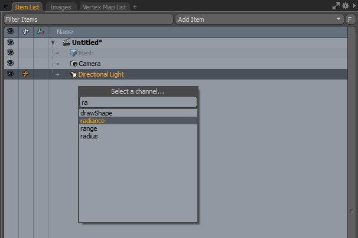
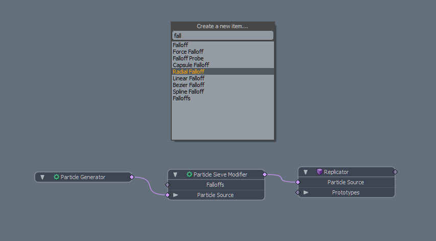
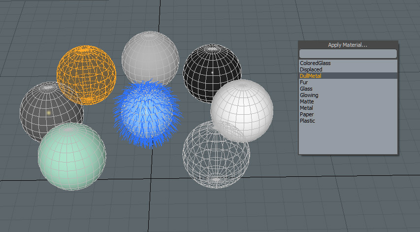
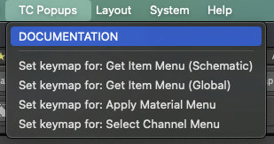

# MODO | KIT | TC PopUps
Hi everyone.

I'm releasing here the kit that was already available on [Gumroad](https://smoluck.gumroad.com/l/tc_popups_15x) as I want to stop supporting Gumroad's founder.

First of all.

Huge Thanks to Tim Crowson for his PopUps kit, as i've used it a lot on Modo 901.

It's a great kit that he've made.

As the kit was not updated to work on Modo 15 and up release, I decided to update the code it and add some features.
Tim kindly gave me his agreement to update and share it.

# RELEASES
* [version 2.1.1](Release/TC_Popups_15X_v2.1.1.lpk)

# DETAILS
* To select channels

* To create item from schematic view

* To search and assign material

# INSTALL
To install the kit, Drag & Drop the LPK into Modo window, then restart Modo.

# TOP MENU BAR
You can now access to a Web page that describe all the commands directly from the Kit via the DOCUMENTATION.

Now you can also set your own Keymaps in the same menu.

# KEYMAPS
Tab under the schematic to add a desired node/item through Popup Menu List.

Ctrl + m to apply a Material through Popup Menu List.

Alt + F1 for every other context.

Alt + i to select a Channel input.

# DISCLAIMER
You need at least Modo `15.0` to run `100 %` of the scripts included.
I try to keep compatibility from `15.0` to `16.X`. but as far as i know the usage of the kit on later release 16.2 is broken due to big change in Modo.

As usual if you found a bug, please reach me out on SNS and i will do my best to help you and fix this.
This is all Free. But keep in mind to give him a huge thanks for his work on LinkedIn and contribute if you will, for things that i've added to it.

# Special Thanks
Tim Crowson

# CONTACT:
[My Website](https://smoluck.com)